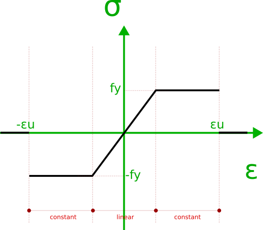

PerfectElasticPlastic
=======================

Represents a perfect elastic plastic behavior material

Curve consist of three regions as in picture.

Constant parts:

Linear part:

.. code-block:: cs

    public static PerfectElasticPlastic PerfectElasticPlastic.Create(double fy, double e, double eu)

parameters:
- e: elastic module of linear section,
- fy: yield stress 
- eu: ultimate strain, i.e. εu in picture