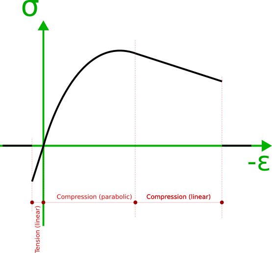

ParabolicLinearConcrete
=======================

Represents a class for general parabolic linear stress strain curve for concrete. It can model tension in concrete if set `AllowTension`.

Curve consist of three regions as in picture. note that horizontal axis is negate of strain.

para-linear.png

Tension part:

If set `ParabolicLinearConcrete.AllowTension = true`, then tension is taken into account, otherwise stress for negative strains would be zero (no tension carried by concrete).
The tension part is linear with elastic module, equal to parabolic part at ε=0. i.e left and right diff of ss curve at ε=0 are equal. 

Parabolic part of compression and linear part.

examples:

.. code-block:: cs

    static ParabolicLinearConcrete ParabolicLinearConcrete.Create(double fc,double ec, bool isContant, bool allowTension = false)
    static ParabolicLinearConcrete ParabolicLinearConcrete.CreateEc2(double fc,bool allowTension=false)